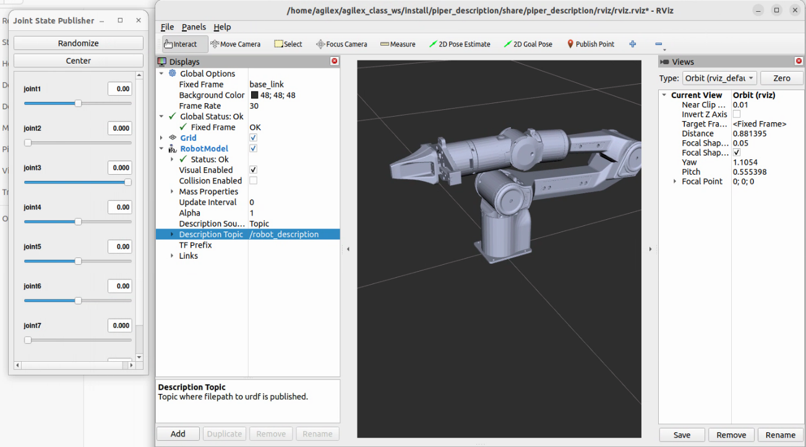

# The Whole Assignment, Explained From Scratch

> You said it's been ~2 years since you touched ROS. This document assumes you
> remember almost nothing. It starts with a plain-English ROS 2 refresher, then
> walks through **what each section of the assignment asks for**, **why**, and
> **what every piece of code in this repo actually does**.
>
> Read it top to bottom once. After that it works as a reference.

---

## Part 0 — A ROS 2 refresher (read this first)

ROS ("Robot Operating System") is **not** an operating system. It's a set of
libraries + conventions for letting many small programs talk to each other while
controlling a robot. This repo uses **ROS 2** (specifically the *Humble* and
*Jazzy* releases).

### The 7 ideas you need

| Concept | One-line meaning | In this repo |
|---|---|---|
| **Node** | A single running program (a process) that does one job. | `scene_loader`, `gr_ik_service`, `coverage_planner`, `wiping_controller` are all nodes. |
| **Topic** | A named "radio channel". Nodes **publish** messages onto it; other nodes **subscribe** to receive them. Fire-and-forget, streaming. | `/joint_states` (where the arm is), `/wrist_ft` (force sensor readings). |
| **Message** | The data structure sent over a topic/service. Has a fixed schema (fields + types). | `JointState`, `WrenchStamped`, `PoseStamped`. |
| **Service** | A request→response call between nodes (like a function call over the network). You ask once, you get one answer. | `/compute_ik` (ask MoveIt "what joint angles reach this pose?"). |
| **Parameter** | A named config value a node reads at startup (set from YAML files). | tool size, target force, patch resolution. |
| **Package** | A folder that bundles one feature's nodes, configs, and launch files. | `gr_scene`, `gr_kinematics`, `gr_coverage`, `gr_wiping_control`. |
| **Launch file** | A Python script that starts several nodes at once with the right params. | `section1.launch.py`, etc. |

**Topic vs Service — the key distinction:**
- *Topic* = continuous stream, no reply (sensor readings, robot state). Think
  of it like a YouTube live stream.
- *Service* = one question, one answer (solve this IK, load this scene). Think
  of it like a phone call.

### How the code is organized: workspace → packages → nodes

```
ros2_ws/                     ← a "colcon workspace" (one big build root)
├── src/                     ← SOURCE code you edit
│   ├── piper_ros/           ← the robot's official files (URDF, MoveIt config) — given by AgileX, not written by us
│   └── gr_assignment/       ← OUR four packages (the actual assignment answers)
│       ├── gr_scene/
│       ├── gr_kinematics/
│       ├── gr_coverage/
│       └── gr_wiping_control/
├── build/                   ← temporary compile artifacts (auto-generated, ignore)
├── install/                 ← the "compiled & ready to run" output (auto-generated)
└── log/                     ← build logs (auto-generated)
```

You build the workspace with one command:

```bash
colcon build --symlink-install --packages-skip piper
```

`colcon` is ROS 2's build tool. `--symlink-install` means "link to my source
files instead of copying them" so editing Python doesn't require a rebuild.
`--packages-skip piper` skips the package that needs the physical CAN-bus
hardware we don't have.

Before you can *run* anything, you "source" the environment so the shell knows
where the nodes live:

```bash
source /opt/ros/humble/setup.bash      # the base ROS install
source ~/ros2_ws/install/setup.bash    # our freshly built packages
```

(Forgetting these two lines is the #1 cause of "command not found" / "package
not found" errors. The `AGENTS.md` calls this out explicitly.)

### URDF and MoveIt (you'll see these everywhere)

- **URDF** ("Unified Robot Description Format") = an XML file describing the
  robot: its links (rigid bodies), joints (how links connect and move), and
  meshes (3D shapes). The Piper's URDF lives in `piper_ros/`. It's the robot's
  "blueprint."
- **MoveIt 2** = the motion-planning framework. Given the URDF, it can answer:
  - *Forward Kinematics (FK):* "if the joints are at these angles, where is the
    hand?"
  - *Inverse Kinematics (IK):* "I want the hand **here** — what joint angles get
    me there?" (the hard one; often multiple or zero solutions)
  - *Collision checking:* "does this pose hit the countertop/faucet/mirror?"
  - *Path planning:* "give me a collision-free joint path from A to B."
  - MoveIt runs as a node called **`move_group`**. Our nodes call its services
    (`/compute_ik`, `/compute_cartesian_path`, `/apply_planning_scene`).

### Coordinate frames & quaternions (so the geometry makes sense)

- A **frame** is a coordinate system attached to something. `base_link` is the
  frame at the robot's base — every pose in this repo is expressed relative to
  it. `link6` is the last link (the wrist/tool mount).
- A **pose** = position (x, y, z) + orientation.
- **Orientation is stored as a quaternion** `(x, y, z, w)` — a 4-number way to
  represent rotation that avoids the "gimbal lock" problems of Euler angles.
  You don't need to do quaternion math by hand; just know `(0,0,0,1)` means "no
  rotation," and the code builds them with helper functions.
  - ⚠️ **Ordering gotcha:** ROS messages use `(x, y, z, w)`. Some configs in this
    repo store the *base tool-down* orientation as `(w, x, y, z)` for readability.
    The code is careful about which is which — watch the variable names.

That's enough theory. Now the assignment.

---

## The robot and the scene (shared by all 3 sections)

- **Robot:** AgileX **Piper**, a **6-DOF** arm (6 motorized joints → 6 degrees
  of freedom, enough to reach a position *and* an orientation in 3D).
- **The scene** (a bathroom/kitchen-like setup) has three obstacles, defined
  once in `gr_scene/config/scene.yaml` (sizes in metres):
  - **Countertop:** a 120 × 60 cm horizontal slab.
  - **Faucet:** a small 6 × 6 × 30 cm vertical box (the thing to avoid).
  - **Mirror:** a 90 × 60 cm vertical pane.

The arm's job across the three sections: **figure out where it can reach
(Sec 1) → plan a wiping path over the surfaces (Sec 2) → actually wipe while
controlling contact force (Sec 3).**

### What the world looks like

These two diagrams are generated directly from the exact numbers in
`scene.yaml` (run `python3 scripts/render_world.py` to regenerate them).
Everything is in the `base_link` frame — the robot's base sits at the origin
`(0, 0, 0)`, the **black square**.

**Top-down view** (looking straight down — the x-y plane). The robot looks out
along +x; +y is to its left. The green dashed box is the 60×60 cm patch
Section 1 tests for reachability.


**Side view** (looking from the side — the x-z plane). The countertop's top
surface sits at `z = 0`; the faucet stands 30 cm tall, the mirror 60 cm tall.


> Reading the layout: the **countertop** is the big slab the arm wipes, the
> **faucet** is the short post it must avoid/skip, and the **mirror** is the
> tall thin pane. The faucet (0.40, 0) and mirror (0.45, 0) were positioned
> **within the arm's reach** (so the mirror is wipeable in Section 2). Note the
> counter (120×60 cm) is *much* bigger than the green reachability patch — and
> even the patch is larger than the arm can fully reach — which is exactly why
> Sections 1 & 2 spend effort on "what's actually reachable." The diagrams are
> rendered live from `scene.yaml` (counter=tan, mirror=blue, faucet=red).

For reference, this is the real AgileX Piper arm these diagrams are built
around (photo from the official `piper_ros` package):



---

## Section 1 — Kinematics & Reachability

### What the assignment asks
1. Set up the arm + a planning scene with the collision objects.
2. Build an **IK service** that solves for reachable, surface-aligned
   end-effector poses and **rejects infeasible ones**.
3. Produce a **reachability heatmap** for a 60 × 60 cm patch of counter at 2 cm
   resolution.
4. Deliver: the IK node, a reachability CSV + heatmap image, and a short
   write-up of "where can/can't the arm reach, and why."

### The concept
"Reachability" = for each target spot on the counter, *can the arm physically
put its tool there without hitting anything?* Answering that for one spot is an
**IK query**. Answering it for a 31×31 grid of spots and coloring the result is
the **heatmap**.

### The code

**`gr_scene/gr_scene/scene_loader.py`** — *puts the obstacles into MoveIt's world.*
- Reads each object's size & pose from `scene.yaml` (ROS parameters).
- `make_box(...)` builds a `CollisionObject` (a box primitive at a pose).
- It calls MoveIt's `/apply_planning_scene` **service** once to inject all three
  boxes. After this, MoveIt *knows* the countertop/faucet/mirror exist, so
  every later collision check accounts for them.
- Note `scene.is_diff = True` — "add these to the existing world," don't replace it.

**`gr_kinematics/gr_kinematics/ik_service.py`** — *our IK service (a thin wrapper).*
- It doesn't implement IK math itself. It **wraps** MoveIt's built-in
  `/compute_ik` service and re-exposes it as `/gr_kinematics/solve_ik`.
- Why wrap it? So the reachability sweep and coverage planner can ask for IK in
  one consistent way, with: collision-checking on by default, a configurable
  timeout, and retry attempts.
- The tricky part (lines 49–83): a ROS service handler that itself needs to
  *call another service* can deadlock. The fix here is the standard rclpy
  pattern — a `MultiThreadedExecutor` + `ReentrantCallbackGroup` + a
  `threading.Event` — so one thread can wait for `/compute_ik`'s reply while
  another keeps the node responsive. (You don't need to memorize this; just know
  the comment explains *why* it isn't the naive `spin_until_future_complete`.)
- "Rejects infeasible solutions" = if MoveIt returns anything other than
  `SUCCESS`, the response carries a failure error code.

**`gr_kinematics/gr_kinematics/reachability.py`** — *the heatmap generator (the star of Section 1).*
- Lays out a grid over the 60×60 cm patch at 2 cm spacing → 31×31 = **961 cells**.
- For each cell it asks `/gr_kinematics/solve_ik`: "can you reach this (x, y) on
  the surface with the tool pointing **straight down** onto it?"
- **The important insight (read the docstring, lines 1–25):** "surface-aligned"
  only pins the tool's *approach axis* (pointing down into the counter). The
  **yaw** — how the flat square pad is spun about that vertical axis — is a
  **free degree of freedom** (a square pad wipes the same at 0° or 90°). An
  earlier version pinned the *full* orientation to one fixed quaternion and got
  a misleading **34/961 (3.5%) reachable**. That wasn't a real workspace limit —
  it was over-constraining a free DOF. The fix: for each cell, **try several yaw
  angles (default 12) and mark the cell reachable if *any* yaw works.** This is
  exactly the kind of "reason about workspace constraints" the assignment
  rewards.
- Outputs:
  - `data/reachability.csv` — one row per cell: `x, y, reachable(0/1), error_code, feasible_yaw_deg`.
  - `data/reachability.png` — the red/green heatmap (green = reachable):


### How to run it
Three terminals (order matters — MoveIt must be up first):
```bash
# A: start MoveIt (provides /compute_ik, /apply_planning_scene)
ros2 launch piper_no_gripper_moveit demo.launch.py
# B: our IK service + load the scene
ros2 launch gr_kinematics section1.launch.py
# C: run the sweep
ros2 run gr_kinematics reachability --ros-args --params-file .../reachability.yaml
```
…or just `bash scripts/section1.sh`, which sequences all three for you.

### What to say in the write-up
"The arm reaches a band in front of its base where the counter is within arm
length and not blocked by the faucet/mirror; it can't reach the far edges
(beyond reach) or spots where every tool yaw collides. Freeing the pad's yaw
turned a misleading 3.5% into the true reachable region." Point at the green
zone in `reachability.png`.

---

## Section 2 — Surface Coverage Path Planning

### What the assignment asks
1. Generate an efficient **coverage path** (a wiping pattern) over the surfaces.
   At least a **raster** (back-and-forth lawnmower) pattern; **bonus: a spiral**
   for the mirror.
2. Convert the Cartesian waypoints into a **joint trajectory** with **time
   parameterization** (i.e. assign timing/velocities, not just positions).
3. Report metrics: **coverage %**, **path length**, **estimated execution time**.
4. Constraints: tool pad is 100×50 mm; tool normal must stay within ±10° of the
   surface normal; keep a 15 mm keep-out margin from edges; 10–20% overlap
   between passes.

### The concept
You want to drag a rectangular pad over a surface so it touches (nearly) all of
it, without going over the edges, with neighboring passes slightly overlapping
so you don't miss strips. Then you must turn that *geometric* path into
*something the arm can actually execute* — joint angles over time.

### The code

**`gr_coverage/gr_coverage/planners.py`** — *pure geometry, no ROS (so it's easy to test).*
- `Surface` (dataclass): represents a flat surface with a center, two in-plane
  axes `u`/`v`, and an outward `normal`. `from_horizontal` builds the counter;
  `from_vertical` builds the mirror. `to_world(...)` converts an in-plane (u, v)
  coordinate (+ a standoff distance along the normal) into a 3D point.
- `raster_path(...)`: the **boustrophedon** (lawnmower) pattern — strokes run
  along `u`, stepping along `v` by `pitch = tool_height × (1 − overlap)`. It
  insets the usable area by `margin + half-tool` so the pad never crosses the
  edge (that's the **15 mm keep-out**). Alternating row direction (left→right,
  then right→left) avoids wasted return travel.
- `spiral_path(...)`: an **Archimedean spiral** wound from outside in — the
  bonus pattern, nicer for the mirror. Each turn advances by the tool footprint
  × (1 − overlap).
- `path_length(...)`: total Euclidean length of the path (a metric).
- `coverage_fraction(...)`: estimates **coverage %** by stamping the pad's
  rectangular footprint along a densified path onto a fine grid and counting how
  much of the (inset) surface got covered.

**`gr_coverage/gr_coverage/coverage_node.py`** — *the ROS node that ties it together.*
- Builds both surfaces, generates the counter **raster** and mirror **spiral**.
- `_orientation_xyzw(...)`: orients the tool so its z-axis points **into** the
  surface (tool normal ≈ surface normal — satisfying the ±10° constraint), then
  applies a yaw. As in Section 1, **yaw is a free DOF**, so…
- `_best_yaw_and_reachable(...)`: searches yaw angles and picks the one that
  makes the **most waypoints IK-reachable**. This keeps the reported coverage
  **honest** — only waypoints the arm can actually strike count. (The 120×60 cm
  counter is far bigger than the Piper's reach, so a large unreachable fraction
  is the *real answer*, not a bug — see the comment at lines 206–215.)
- `_largest_run(...)`: finds the longest *contiguous* stretch of reachable
  waypoints, so the executed stroke has no teleport-jumps across dead gaps.
- For that stroke it calls MoveIt's **`/compute_cartesian_path`** to get joint
  angles that follow the straight Cartesian line, retrying a few times because
  IK is non-deterministic (the start configuration affects feasibility).
- `_retime(...)`: MoveIt's Cartesian path comes back **un-timed** (positions
  only). This assigns each segment a duration so no joint exceeds a speed limit,
  and fills in per-joint velocities — that's the **time parameterization** the
  assignment wants. (Trade-off noted in code: this is a simple home-grown
  retime, not MoveIt's smoother TOTG/IPTP — dependency-free but less smooth.)
- Outputs (per surface): `coverage_path_<counter|mirror>.csv`,
  `coverage_trajectory_<...>.yaml`, and a combined `coverage_path.png` showing
  reachable (green) / unreachable (red) waypoints and the executed stroke (navy):

  

- Logs the metrics: geometric coverage %, executable coverage %, reachable
  waypoint fraction, path length, Cartesian success fraction, exec time.

### How to run it
```bash
bash scripts/section2.sh        # needs move_group running, like Section 1
```

### What to say in the write-up (raster vs spiral)
Raster is simple, predictable, and gives even coverage on rectangles → good for
the countertop. Spiral has fewer sharp reversals and suits a centered region
like the mirror, but leaves corners. Mention that true coverage is limited by
**reach**, not the pattern — hence two coverage numbers (geometric vs
executable).

---

## Section 3 — Contact-Aware Wiping Control

### What the assignment asks
1. A controller that **switches to force control** when the normal force
   |Fz| > 2 N (i.e. once the pad actually touches the surface).
2. **Maintain a target force** while following the path (counter: 10 N ±2 N at
   0.15–0.25 m/s; mirror: 6 N ±1.5 N at 0.1–0.2 m/s), and **back off** if force
   spikes above 15 N (safety).
3. **Handle an obstacle** (the faucet) by skipping/replanning locally.
4. **Log and plot** force-vs-time and velocity-vs-time.

### The concept
Position control alone is dangerous in contact: command the hand 1 mm too low
into a rigid counter and force spikes enormously. So you switch to **force /
admittance control**: instead of commanding an exact height, you *adjust* the
push depth to achieve a *target force*. Push too soft → press a bit more; too
hard → ease off; dangerously hard → retract.

This section uses a **Gazebo Classic** simulation (a physics simulator) with a
real **wrist force/torque (F/T) sensor**, so there are genuine contact forces to
react to. (Isaac Sim was dropped — it segfaulted on the driver; the old PyBullet
sim is superseded.) Two non-obvious simulator facts shaped the whole design, and
both are spelled out in the code comments:

1. **F/T sensing.** Gazebo Classic's `gazebo_ros2_control` *cannot* expose a
   force-torque sensor as a control interface ("Conversion of sensor type
   [force_torque] not supported"), so the standard `force_torque_sensor_broadcaster`
   route is a dead end. Instead the stock **`gazebo_ros_ft_sensor` plugin** is
   attached to **joint6** and publishes the reaction wrench on `/wrist_ft`.
2. **Why effort control, not position.** Humble's `gazebo_ros2_control` drives a
   *position* command interface **kinematically** (`SetPosition`) — the arm
   teleports and passes *through* the counter, so the sensor never sees contact.
   Commanding **effort** instead makes Gazebo use `SetForce`, so contact becomes
   physical. The `arm_controller` is therefore a `JointTrajectoryController` with
   an **effort** interface + per-joint PID gains (`config/wiping_controllers.yaml`),
   which turn the streamed position trajectory into joint torques.

**The bring-up files** (all in `gr_wiping_control/`):
- `description/piper_wiping.xacro` — the Piper plus a 100×50 mm wiping **pad**
  (`tool_link`), the wrist F/T plugin, a **compliant contact** (`kp/kd`) on the
  pad so force grows smoothly with penetration (~10 N at ~1 mm), and the joints
  switched to the effort interface.
- `worlds/wiping.world` — the countertop/faucet/mirror as collision boxes.
- `launch/gazebo_wiping.launch.py` — starts Gazebo + spawns the robot + loads
  `joint_state_broadcaster` and `arm_controller` (`gui:=false` for headless).

### The control loop (what the code does each tick)
```
Gazebo F/T sensor --/wrist_ft--> controller --/arm_controller/joint_trajectory--> Gazebo
```

**`gr_wiping_control/gr_wiping_control/kdl_chain.py`** — *FK / Jacobian / IK helper.*
- Builds a **KDL** chain straight from the live URDF (`kdl_parser_py` isn't
  installed, so it constructs the chain itself). Provides forward kinematics
  (joints → tool pose), an **LMA position-IK** solver (used to seed the approach),
  and — crucially — `cart_diff` + `vel_ik`: the **Jacobian-based velocity IK**
  used for smooth streaming. No MoveIt round-trip, fast enough for 50 Hz.

**`gr_wiping_control/gr_wiping_control/controller.py`** — *the contact-aware controller.*
It's a **state machine** (each `_tick` at 50 Hz advances it):
- **APPROACH** — move above the stroke start, tool pointing down (a one-shot
  joint-space move; IK uses a "forward elbow-down" seed so the arm doesn't flip
  into a backward branch). It proceeds on a relaxed tolerance/timeout — effort+PID
  won't track exactly. Once settled, **tare** the F/T sensor (record the
  no-contact bias).
- **DESCEND** — lower slowly until the normal force crosses 2 N → contact. The
  contact height is then set to the **known geometry** (`link6 at z = tool_len`,
  surface at z=0), *not* the measured value — measuring it records it too deep
  (the pad penetrates before contact is detected) and pins the force high.
- **CONTACT** — the heart of it. Advance along the wipe stroke at target speed
  while running an **admittance law**: `depth += Kp·(F_target − F) + Ki·∫error`.
  This is a PI controller on **force**, nudging the push depth so the measured
  force tracks 10 N (counter) / 6 N (mirror). `_normal_force()` rotates the wrench
  from the link6 frame to world and takes the tare-corrected normal component.
- **BACKOFF** — if |Fn| > 15 N, ease off the push depth (keeps moving) until force
  drops back into range. (The safety requirement.)
- **SKIP** — if the path comes within `skip_radius` of the faucet, **lift the
  tool over it** (negative depth = raise) and suspend force control there. That's
  the "handle an obstacle locally" requirement.
- **DONE** — after the requested passes (or a hard time cap), write outputs and exit.

**Command streaming = differential IK.** Rather than re-solving IK every tick
(successive solutions jump between elbow/wrist branches → the arm jerks),
`_diff_track` nudges the *commanded* joint vector continuously:
`q += clamp(J⁺·Δx)` toward the target Cartesian pose, with the Cartesian step
clamped (which also caps tool speed). It streams one `JointTrajectory` point to
the `arm_controller` each tick and logs `(t, forces, velocity, mode, depth)`.

- On shutdown it writes `data/wiping_log.csv` and `data/wiping_log.png` — the
  **force-vs-time and velocity-vs-time plots**, with the target band, the 2 N
  contact line, and the 15 N back-off line drawn in:

  

### How to run it
```bash
bash scripts/section3.sh run    # Gazebo (headless) + the controller, writes data/wiping_log.*
# or: scripts/section3.sh sim   (just the Gazebo scene, GUI) ; scripts/section3.sh ctrl (just the controller)
```

### What the plot shows (and an honest limitation)
The force is **regulated around the 10 N target** (dense band on the target line),
the **15 N back-off fires** on overshoots, and the tool **lifts over the faucet**.
But it also shows **contact chatter** — intermittent spikes above 15 N and speed
above the 0.15–0.25 m/s band. That's the classic behaviour of a *stiff
effort-controlled arm bouncing on a near-rigid surface* without a true force
controller. Mitigations that help (compliant pad, fine admittance step,
differential-IK continuity, known contact height) are in the code; a fully clean
10 N±2 N hold would need softer joint gains / an explicit force inner loop / the
installed `admittance_controller`, or mounting the arm on a pedestal so it isn't
wiping at its own base plane. This trade-off is documented in `WIPING_NOTES.md`.

---

## How the whole thing runs (Docker)

You don't install ROS on your laptop — everything runs in **Docker** containers
(per your setup). The flow:

```bash
bash docker/setup_host.sh                 # one time: NVIDIA toolkit + X11 for GUIs
cd docker
docker compose build humble jazzy         # build the container images
docker compose up -d humble jazzy         # start them
docker compose exec humble bash           # get a shell inside
# inside the container:
source /opt/ros/humble/setup.bash
cd ~/ros2_ws && colcon build --symlink-install --packages-skip piper
source install/setup.bash
bash scripts/section1.sh                  # (and section2.sh, section3.sh)
```

- **Humble** is the primary container (AgileX's `piper_ros` officially supports
  it; Gazebo Classic). **Jazzy** is the newer LTS (Gazebo Harmonic; would need
  some URDF/xacro porting).
- The `data/` folder is **mounted** into the container at `~/data`, so all CSVs,
  PNGs, and logs the nodes write land back in your repo automatically.
- `docker/entrypoint.sh` just sources ROS + the workspace every time a shell
  starts, so you don't have to.

### Where the outputs you can show off live (`data/`)
| File | From | What it is |
|---|---|---|
| `reachability.csv` / `.png` | Sec 1 | reachable cells + heatmap |
| `coverage_path_counter.csv`, `coverage_path_mirror.csv` | Sec 2 | waypoints (raster / spiral) |
| `coverage_trajectory_*.yaml` | Sec 2 | timed joint trajectories |
| `coverage_path.png` | Sec 2 | path + reachability visualization |
| `wiping_log.csv` / `.png` | Sec 3 | force & velocity vs time |

(Verbose `data/*.log` console logs are git-ignored — regenerable, and one had
ballooned to 12 GB. Per-section design notes live next to the code:
`gr_kinematics/REACHABILITY_NOTES.md`, `gr_coverage/COVERAGE_NOTES.md`,
`gr_wiping_control/WIPING_NOTES.md`; fresh-clone steps are in `REPRODUCE.md`.)

---

## One-paragraph summary to anchor your memory

Three nodes you wrote answer three questions about a 6-DOF Piper arm wiping a
bathroom counter/mirror: **Section 1** asks *where can it reach* (IK service +
reachability heatmap, with the key trick that the pad's yaw is a free DOF you
must search over). **Section 2** asks *what path should it wipe* (raster on the
counter, spiral on the mirror, turned into a time-parameterized joint trajectory,
with coverage/length/time metrics — honest about how much is actually
reachable). **Section 3** asks *how does it wipe safely* (a state-machine
admittance controller that detects contact at 2 N, holds the target force, backs
off at 15 N, and lifts over the faucet, logging force/velocity). Everything runs
in Docker, talks over ROS 2 topics/services to MoveIt and Gazebo, and dumps its
results into `data/`.
```
